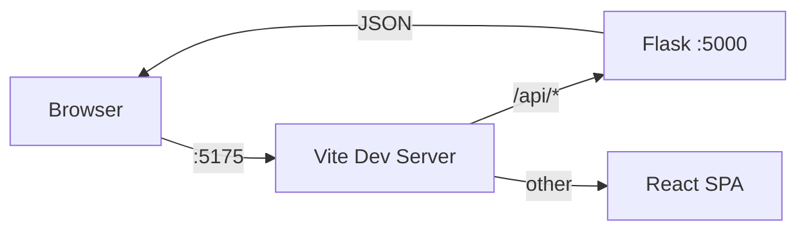
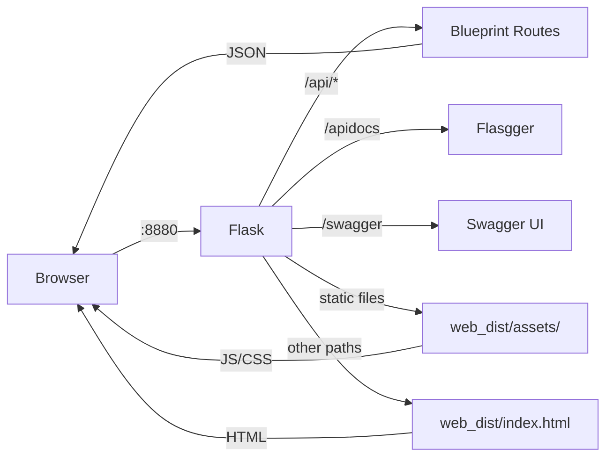
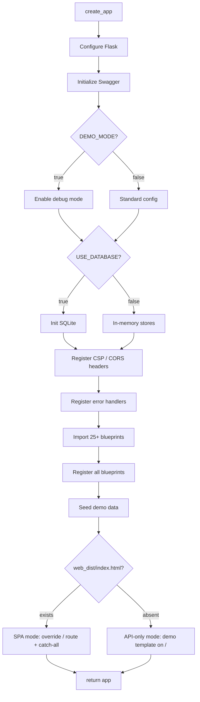
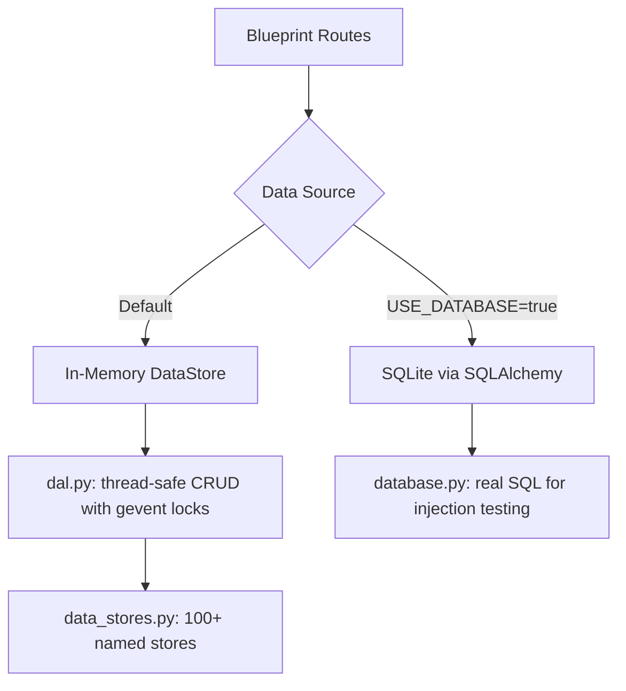

# Architecture

## System Overview

Chimera is a pnpm + Nx monorepo containing two applications that can run independently in development or be bundled into a single Python package for distribution.

```
                    ┌─────────────────────────────────────┐
                    │           Chimera Monorepo           │
                    │                                     │
                    │  ┌──────────────┐ ┌──────────────┐  │
                    │  │   vuln-api   │ │   vuln-web   │  │
                    │  │  Flask/Python│ │ React/Vite/TS│  │
                    │  │  Port 5000   │ │  Port 5175   │  │
                    │  └──────┬───────┘ └──────┬───────┘  │
                    │         │                │          │
                    │         │    Vite Proxy   │          │
                    │         │◄── /api/* ──────┘          │
                    │         │                            │
                    └─────────┴────────────────────────────┘
```

## Request Routing

### Development Mode (two servers)



In development, the Vite dev server on port 5175 proxies `/api/*` requests to Flask on port 5000. All other routes serve the React SPA with hot module replacement.

### Production Mode (single server)



When `web_dist/index.html` exists, Flask serves both the API and the SPA from a single process. The catch-all route handles three cases:

1. **API prefixes** (`api/`, `apidocs`, `flasgger_static`, `apispec`) — returns JSON 404 for missing API routes
2. **Static files** — serves JS, CSS, and images from `web_dist/`
3. **Everything else** — returns `index.html` for React Router client-side routing

### API-Only Mode (no web_dist)

When `web_dist/index.html` is absent, Flask serves the built-in demo template at `/` and the API operates standalone. This is the default for development and API-only installs.

## Flask Application Factory



## Blueprint Architecture

Each industry domain is a self-contained Flask blueprint in `app/blueprints/{domain}/`:

```
app/blueprints/
├── auth/              # JWT, MFA, sessions, API keys (30 routes)
├── banking/           # Accounts, transfers, KYC (29 routes)
├── healthcare/        # HIPAA, PHI, claims (31 routes)
├── ecommerce/         # Cart, checkout, gift cards (48 routes)
├── insurance/         # Policies, claims, underwriting (42 routes)
├── saas/              # Multi-tenant, SAML, billing (30 routes)
├── government/        # Citizen services, benefits (28 routes)
├── telecom/           # SIM swaps, CDR, porting (23 routes)
├── energy_utilities/  # SCADA, meters, grid control (23 routes)
├── admin/             # System admin, config (20 routes)
├── payments/          # Card processing, refunds (18 routes)
├── mobile/            # Biometric, device trust (15 routes)
├── compliance/        # AML, sanctions, audit (16 routes)
├── loyalty/           # Points, rewards (14 routes)
├── integrations/      # Webhooks, SSRF targets (13 routes)
├── checkout/          # Payment flow (12 routes)
├── ics_ot/            # Industrial control (10 routes)
├── infrastructure/    # Cloud, secrets (18 routes)
├── security_ops/      # Blue team tools (8 routes)
├── attack_sim/        # Red team simulation (25 routes)
├── testing/           # Test utilities (7 routes)
├── genai/             # AI/ML exploitation (4 routes)
├── diagnostics/       # System diagnostics (2 routes)
├── recorder/          # Traffic recording (3 routes)
├── throughput/        # Performance testing (2 routes)
├── main/              # Health check, home (2 routes)
└── database_vulnerable/ # Real SQLi endpoints (8 routes)
```

## Data Layer



- **In-memory mode** (default): `DataStore` and `TransactionalDataStore` classes provide thread-safe CRUD with gevent locks. 100+ named stores defined in `data_stores.py`.
- **Database mode** (`USE_DATABASE=true`): SQLite via SQLAlchemy enables real SQL injection vulnerabilities.

## Build Pipeline


The `chimera-api:build` Nx target declares a dependency on `vuln-web:build:bundle`. Running `just bundle` (or `pnpm nx run chimera-api:build`) triggers the full pipeline:

1. **TypeScript check** — `tsc -b` validates the React code
2. **Vite bundle** — builds the SPA into `apps/vuln-api/app/web_dist/`
3. **Python wheel** — `uv build` packages everything via hatchling, with `force-include` ensuring `web_dist/` makes it into the wheel despite being gitignored

## CSP Header Strategy

| Route Type | `style-src` | Reason |
|------------|-------------|--------|
| `/swagger`, `/openapi.yaml` | `'self' unpkg.com 'unsafe-inline'` | Swagger UI needs external CDN + inline styles |
| `/api/*`, `/apidocs`, `/flasgger_static` | `'self'` | Strict CSP for API responses |
| All other paths (SPA) | `'self' 'unsafe-inline'` | Tailwind/Vite require inline styles |

## Environment Variables

| Variable | Default | Description |
|----------|---------|-------------|
| `DEMO_MODE` | `true` | `full` enables all vulns, `strict` blocks dangerous endpoints |
| `USE_DATABASE` | `false` | Enable SQLite for real SQL injection |
| `DATABASE_PATH` | `demo.db` | SQLite file location |
| `PORT` | `80` | Server port (container), CLI defaults to `8880` |
| `DEMO_THROUGHPUT_MODE` | `false` | Enable throughput testing short-circuit |
| `DEMO_THROUGHPUT_PATHS` | `` | Comma-separated paths to short-circuit |
